# Cuckoo-Installation
This is an introductory chapter to Cuckoo Sandbox. It explains some basic malware analysis concepts, what’s Cuckoo and how it can fit in malware analysis.

Prerequisite for ubuntu 18.04
-

#Update apt cache and upgrade packages

    sudo apt update
    sudo apt upgrade

#Install Cuckoo Dependencies

    sudo apt-get install python python-pip python-dev libffi-dev libssl-dev -y
    sudo apt-get install python-virtualenv python-setuptools -y
    sudo apt-get install libjpeg-dev zlib1g-dev swig -y

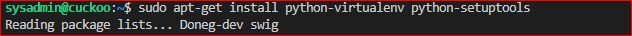
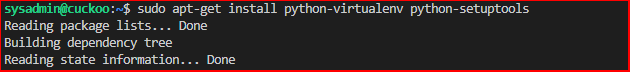
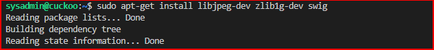

#Install mongo db in order to use Django-based web Interface

    sudo apt-get install mongodb -y

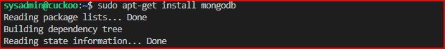

#In order to use PostgreSQL as database

    sudo apt-get install postgresql libpq-dev -y

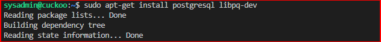

#install virtualbox for virtualization

    sudo apt install virtualbox -y

Install tcpdump
-

#To ensure the network activities are properly captured and dumped, it is essential to configure the network sniffer accurately. tcpdump, an open source solution, is widely adopted by Cuckoo for this purpose. It effectively captures the traffic and stores it in a file. Therefore, using tcpdump helps you dump the virus activity successfully, thereby helping you stay ahead of any malicious software.

    sudo apt-get install tcpdump apparmor-utils -y

#Added PCAP group

    sudo groupadd pcap

#Added sysadmin to the PCAP group

    sudo usermod -a -G pcap sysadmin

#Change the tcpdump binary to the pcap group for sysadmin to be able to run tcpdump

    sudo chgrp pcap /usr/sbin/tcpdump
    sudo setcap cap_net_raw,cap_net_admin=eip /usr/sbin/tcpdump

#Verify the above command worked

    getcap /usr/sbin/tcpdump

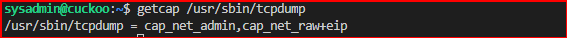

#Disable the tcpdump for cuckoo to be able to capture the netwrok traffic that leaves and enters the sanbox

    sudo aa-disable /usr/sbin/tcpdump

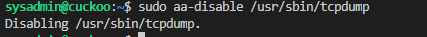

#required python library

    sudo pip install m2crypto

#Grant sysadmin permission to be able to run virtualbox

    sudo usermod -a -G vboxusers sysadmin

#Setup Cuckoo Virtual Environment

    cd /opt

    sudo nano cuckoo-virtualenv-setup.sh

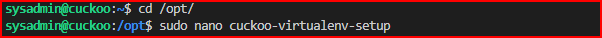

    #!/usr/bin/env bash

    # NOTES: Run this script as: sudo -u <USERNAME> cuckoo-setup-virtualenv.sh

    # install virtualenv
    sudo apt-get update && sudo apt-get -y install virtualenv

    # install virtualenvwrapper
    sudo apt-get -y install virtualenvwrapper

    echo "source /usr/share/virtualenvwrapper/virtualenvwrapper.sh" >> ~/.bashrc

    # install pip for python3
    sudo apt-get -y install python3-pip

    # turn on bash auto-complete for pip
    pip3 completion --bash >> ~/.bashrc

    # avoid installing with root
    pip3 install --user virtualenvwrapper

    echo "export VIRTUALENVWRAPPER_PYTHON=/usr/bin/python3" >> ~/.bashrc

    echo "source ~/.local/bin/virtualenvwrapper.sh" >> ~/.bashrc

    export WORKON_HOME=~/.virtualenvs

    echo "export WORKON_HOME=~/.virtualenvs" >> ~/.bashrc

    echo "export PIP_VIRTUALENV_BASE=~/.virtualenvs" >> ~/.bashrc

#Make the script an excutable and run the script

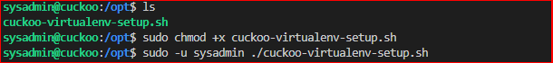

    sudo chmod +x cuckoo-virtualenv-setup.sh
    sudo -u sysadmin ./cuckoo-virtualenv-setup.sh

#load Current virtual environment

    source ~/.bashrc

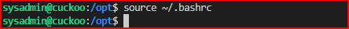

#Make test virtual evironment 

    mkvirtualenv -p python2.7 cuckoo-test

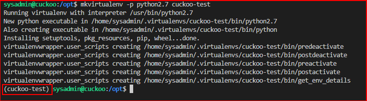

#Update setuptools and install cuckoo within the cuckoo-test virtual environment

    pip install -U pip setuptools
    pip install -U cuckoo

Setup Virtual Machine
-

#Download windows7 Iso provided by cuckoo within the virtual environment. Create a directory to mount the iso, change the ownership and mount it.

    sudo wget https://cuckoo.sh/win7ultimate.iso
    sudo mkdir /mnt/win7
    sudo chown sysadmin:sysadmin /mnt/win7/
    sudo mount -o ro,loop win7ultimate.iso /mnt/win7

#VMCloak Installation
#this help create a snapshot so we do not have to download the windows iso everytime

#Dependencies

    sudo apt-get -y install build-essential libssl-dev libffi-dev python-dev genisoimage
    sudo apt-get -y install zlib1g-dev libjpeg-dev
    sudo apt-get -y install python-pip python-virtualenv python-setuptools swig

#Install vmcloak

    pip install -U vmcloak

#Create virtual network for the sandbox

    vmcloak-vboxnet0

#Create and added image to repository

    vmcloak init --verbose --win7x64 win7x64base --cpus 2 --ramsize 2048

# Note I ran out of space when i ran this comman find the error at the error section and how to fix it Space Error

#Clone the image to be able to create a snapshot

    vmcloak clone win7x64base win7x64cuckoo

install sofware that we want to be added to windows 
-

#the deps will list all the softwae that will be bundled with the windows ISO

    vmcloak list deps

# added internet explorer java and adobe

    vmcloak install win7x64cuckoo ie11 java7 adobe9

#Take snapshot so we don't have to install the windows iso add software to the iso
#this will create 1 vm.
#if you aded 2 or more vms, you dont have to add additinal IP cloak will increment it 

    vmcloak snapshot --count 1 win7x64cuckoo 192.168.56.101

#list the nw created

    vmcloak list vms

--------------interacting with cuckoo--------

Insternet Access
-
#Iptable runs that allows the VM that are creating the analysis to access the internet
#Like if a malware iss trying to connect to a command and control server
#sudo sysctl -w net.ipv4.conf.*your interface name*.forwarding=1

    sudo sysctl -w net.ipv4.conf.vboxnet0.forwarding=1
    sudo sysctl -w net.ipv4.conf.ens160.forwarding=1

#to make the above command persistent add them to the sysctl.conf so after system reboot it will apply the system for you

    sudo nano /etc/sysctl.conf

    net.ipv4.conf.vboxnet0.forwarding=1
    net.ipv4.conf.ens160.forwarding=1

#Add you interface name
#sudo iptables -t nat -A POSTROUTING -o *your interface name* -s 192.168.56.0/24 -j MASQUERADE

    sudo iptables -t nat -A POSTROUTING -o ens160 -s 192.168.56.0/24 -j MASQUERADE
    sudo iptables -P FORWARD DROP
    sudo iptables -A FORWARD -m state --state RELATED,ESTABLISHED -j ACCEPT
    sudo iptables -A FORWARD -s 192.168.56.0/24 -j ACCEPT

#Verify the IPTABLE rules were added

    sudo iptables -vnL

#If you get disconnected from the virtual environment

    wonkon cuckoo-test

#Initialize cockoo and make sure you have access to the community repo

    cuckoo init
    cuckoo community

#Route traffic to the internet

    cuckoo rooter --sudo --group sysadmin

#On a different window edith the cuckoo config file

    cd .cuckoo/conf

#Edith the virtaulbox.conf and the routing.conf
#this will take the VM that we created and add it to the config file to specific the machine to use 

    while read -r vm ip; do cuckoo machine --add $vm $ip; done < <(vmcloak list vms)

#Verify is has been added

    nano virtualbox.conf

#Remove everthing under [cuckoo1] it nolonger exist

    [cuckoo1]

#Edith the Router.conf and add the interface to the internet

    internet = ens160

#Mogodb will be the webgui of cuckoo so enable the feedback

    enabled = no

#Start cuckoo

    cuckoo

#To access the web UI on yet another terminal

    cuckoo web --host 127.0.0.1 --port 8080

#Test cuckoo 
#Download eicar

    https://www.eicar.org/download-anti-malware-testfile/

Error
-

https://www.youtube.com/watch?v=-APw5Y9ow6s

#create physical volume for the new drive

    sudo pvcreate /dev/sda4

#Verify the volume has been created

    sudo vgs
    sudo vgdisplay

#Extend the volume group 

    sudo vgextend ubuntu-vg /dev/sda4

	#Verifty

	sudo vgdisplay

#Extend the filesystem

    sudo lvextend -l+100%FREE /dev/mapper/ubuntu--vg-ubuntu--lv

    #verify if the disk has been extend (It shouldn't)
	
    df -h

#Resize the filesystem
    
    resize2fs /dev/mapper/ubuntu--vg-ubuntu--lv

#Note: 
#if you just want to extend the 8G or less use this command and adjust accordingly 

    sudo lvextend -L +2G /dev/mapper/ubuntu--vg-ubuntu--lv

Resources
-

    #Python installation

    https://linuxize.com/post/how-to-install-pip-on-ubuntu-20.04/

    #Docker install

    https://github.com/blacktop/docker-cuckoo