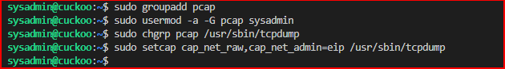

# Cuckoo-Installation
This is an introductory chapter to Cuckoo Sandbox. It explains some basic malware analysis concepts, what’s Cuckoo and how it can fit in malware analysis.

Resources
-

#Python installation

https://linuxize.com/post/how-to-install-pip-on-ubuntu-20.04/

Prerequisite for ubuntu 18.04
-

#Update apt cache and upgrade packages

    sudo apt update
    sudo apt upgrade

#Install Cuckoo Dependencies

    sudo apt-get install python python-pip python-dev libffi-dev libssl-dev
    sudo apt-get install python-virtualenv python-setuptools
    sudo apt-get install libjpeg-dev zlib1g-dev swig

#Install mongo db in order to use Django-based web Interface

    sudo apt-get install mongodb

#In order to use PostgreSQL as database

    sudo apt-get install postgresql libpq-dev

#install virtualbox for virtualization

    sudo apt install virtualbox -y

Install tcpdump
-

#To ensure the network activities are properly captured and dumped, it is essential to configure the network sniffer accurately. tcpdump, an open source solution, is widely adopted by Cuckoo for this purpose. It effectively captures the traffic and stores it in a file. Therefore, using tcpdump helps you dump the virus activity successfully, thereby helping you stay ahead of any malicious software.

    sudo apt-get install tcpdump apparmor-utils -y

#Added PCAP group

    sudo groupadd pcap

#Added sysadmin to the PCAP group

    sudo usermod -a -G pcap sysadmin

#Change the tcpdump binary to the pcap group for sysadmin to be able to run tcpdump

    sudo chgrp pcap /usr/sbin/tcpdump
    sudo setcap cap_net_raw,cap_net_admin=eip /usr/sbin/tcpdump

#Verify the above command worked

    getcap /usr/sbin/tcpdump

#Disable the tcpdump for cuckoo to be able to capture the netwrok traffic that leaves and enters the sanbox

sudo aa-disable /usr/sbin/tcpdump

#required python library

    sudo pip install m2crypto

#Grant sysadmin permission to be able to run virtualbox

    sudo usermod -a -G vboxusers sysadmin

#Setup Cuckoo Virtual Environment

    sudo nano cuckoo-virtualenv-setup.sh

    #!/usr/bin/env bash

    # NOTES: Run this script as: sudo -u <USERNAME> cuckoo-setup-virtualenv.sh

    # install virtualenv
    sudo apt-get update && sudo apt-get -y install virtualenv

    # install virtualenvwrapper
    sudo apt-get -y install virtualenvwrapper

    echo "source /usr/share/virtualenvwrapper/virtualenvwrapper.sh" >> ~/.bashrc

    # install pip for python3
    sudo apt-get -y install python3-pip

    # turn on bash auto-complete for pip
    pip3 completion --bash >> ~/.bashrc

    # avoid installing with root
    pip3 install --user virtualenvwrapper

    echo "export VIRTUALENVWRAPPER_PYTHON=/usr/bin/python3" >> ~/.bashrc

    echo "source ~/.local/bin/virtualenvwrapper.sh" >> ~/.bashrc

    export WORKON_HOME=~/.virtualenvs

    echo "export WORKON_HOME=~/.virtualenvs" >> ~/.bashrc

    echo "export PIP_VIRTUALENV_BASE=~/.virtualenvs" >> ~/.bashrc

#Make the script an excutable and run the script

    sudo chmod +x cuckoo-virtualenv-setup.sh
    sudo -u sysadmin ./cuckoo-virtualenv-setup.sh

#load Current virtual environment

    source ~/.bashrc

#Make test virtual evironment 

    mkvirtualenv -p python2.7 cuckoo-test

#Update setuptools and install cuckoo within the cuckoo-test virtual environment

    pip install -U pip setuptools
    pip install -U cuckoo

Setup Virtual Machine
-

#Download windows7 Iso provided by cuckoo within the virtual environment. Create a directory to mount the iso, change the ownership and mount it.

    sudo wget https://cuckoo.sh/win7ultimate.iso
    sudo mkdir /mnt/win7
    sudo chown sysadmin:sysadmin /mnt/win7/
    sudo mount -o ro,loop win7ultimate.iso /mnt/win7

#VMCloak Installation
#this help create a snapshot so we do not have to download the windows iso everytime

#Dependencies

    sudo apt-get -y install build-essential libssl-dev libffi-dev python-dev genisoimage
    sudo apt-get -y install zlib1g-dev libjpeg-dev
    sudo apt-get -y install python-pip python-virtualenv python-setuptools swig

#Install vmcloak

    pip install -U vmcloak

#Create virtual network for the sandbox

    vmcloak-vboxnet0

#Confiure sandbox

